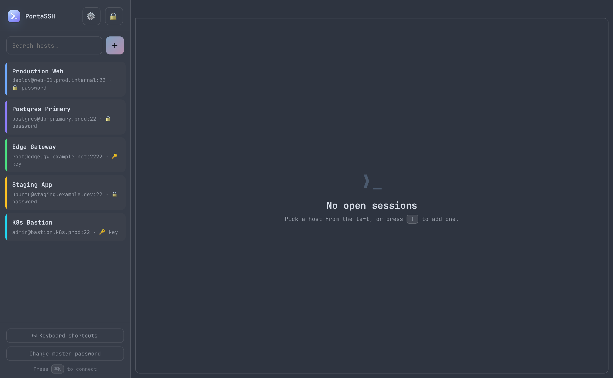

<div align="center">


# PortaSSH

### A portable, encrypted SSH connection manager.

**PortaSSH** is a **connection manager for SSH** in a single binary you can carry
on a USB stick. It keeps all your SSH credentials — hosts, users, passwords, and
private keys — in one encrypted vault behind a master password, and lets you open
and manage secure terminal sessions to any of them from a modern, keyboard-driven
UI that opens in a **native application window** — no console, no browser. No
installation. No background services. Nothing written outside its own folder.

[](LICENSE)


</div>

---

## ✨ Why PortaSSH?

You're a system engineer with dozens of hosts. You hop between machines that
aren't yours. You want your entire SSH world — credentials, keys, host list —
**encrypted on a stick**, usable anywhere, with a UI that's actually pleasant.

PortaSSH is that: one Go binary with the whole UI, fonts, and terminal baked in.
Plug in the stick, run it, unlock with your master password, and you're home.

## 🚀 Features

- 🔐 **Encrypted credential vault** — all hosts, passwords, and private keys live
  in a single `portassh.vault` file, encrypted with **AES‑256‑GCM** using a key
  derived from your master password via **Argon2id**. Keys exist only in memory
  and are wiped on lock.
- 💾 **Truly portable** — a single static binary with zero dependencies. Copy it
  to a USB stick alongside its vault and go. Cross-compiles to macOS, Linux, and
  Windows.
- 🗂️ **Organise your hosts** — colour-code, search, and reorder them (move up /
  down) in a **collapsible, resizable** sidebar. Order and layout are saved and
  travel with the vault.
- 🖥️ **Multiple concurrent sessions** — tabbed terminals, each a real interactive
  PTY over SSH, powered by [xterm.js](https://xtermjs.org/).
- ⌨️ **Keyboard-first workflow** — a **command palette** (`⌘K` / `Ctrl+Shift+K`)
  to fuzzy-search and connect, plus shortcuts for everything. Built for people
  who live in the terminal.
- 🎨 **Beautiful, modern UI** — ships in a polished **Dracula** theme by default,
  with a *System (auto)* option that follows your OS, and a built-in shortcuts
  overlay.
- 🔤 **Seven bundled coding fonts** — JetBrains Mono, Fira Code, Cascadia Code,
  IBM Plex Mono, Source Code Pro, Roboto Mono, and system monospace — all
  embedded, all offline. Tune font, size, and line-height in **Settings**.
- 🌈 **Terminal colour schemes** — nine popular presets (Dracula, Nord, One Dark,
  Monokai, Gruvbox, Solarized Dark/Light, Tomorrow Night, GitHub Light) plus
  custom **background / foreground** colour pickers.
- 🖌️ **Whole-app theming** — apply any of those schemes (or *System (auto)*) to
  the *entire* interface, not just the terminal. The UI palette is derived live
  from the scheme, and the terminal follows along automatically.
- 💾 **Settings that persist** — all preferences are saved in a JSON file *next to
  the vault*, so they survive restarts and travel with the stick (not tied to the
  browser or the random port).
- 🪟 **Native app window** — opens in its own OS window (embedded WebView) with
  its own dock/taskbar icon — no console, no browser, no browser extensions that
  could observe the page. Loopback-only, gated behind a per-launch session token.
  (A `--browser` mode is still available if you prefer.)
- 🔎 **TOFU host-key verification** — trust-on-first-use `known_hosts` that travels
  with the vault; a changed host key is treated as a hard error.

## 📸 Screenshots

|  |  |
|---|---|
| **Locked vault** — Argon2id + AES‑256‑GCM | **Your hosts, colour-coded** |
|  |  |
| **Command palette** — connect in two keystrokes | **Settings** — fonts, themes & colours (live, persisted) |
|  |  |
| **Shortcuts overlay** — platform-aware | **Light schemes too** — e.g. GitHub Light |
|  |  |

**Whole-app theming** — the entire UI recolours to any scheme (here: Nord):

<div align="center"></div>

## 📦 Getting started

### Requirements
- To **run**: the OS web engine for the native window —
  **macOS** (WKWebView) and **Windows 10/11** (WebView2) have it built in;
  **Linux** needs WebKitGTK (`libwebkit2gtk-4.1-0`). No browser required.
  *(Or run with `--browser` to use a browser window instead, or
  `-tags nowindow` builds which are pure-Go and always browser-based.)*
- To **build**: [Go 1.26+](https://go.dev/dl/) with a C compiler (cgo) for the
  native window; on Linux also the WebKitGTK dev headers
  (`libgtk-3-dev libwebkit2gtk-4.1-dev`).

### Download a release

Grab a prebuilt binary for your platform from the
[**Releases**](../../releases) page — one file, no installer. Builds are
produced by CI for macOS (Intel + Apple Silicon), Linux (amd64 + arm64), and
Windows. Each release ships a `SHA256SUMS` file and detached **GPG signatures**
(`.asc`) so you can confirm a download is genuine and untampered:

```bash
# 1) once: import the PortaSSH signing key (committed as SIGNING-KEY.asc)
gpg --import SIGNING-KEY.asc

# 2) verify the checksum list really came from the maintainer
gpg --verify SHA256SUMS.asc SHA256SUMS        # look for "Good signature"

# 3) verify your binary matches the now-trusted checksums
sha256sum -c SHA256SUMS --ignore-missing      # (shasum -a 256 -c on macOS)

chmod +x portassh-*        # macOS / Linux
./portassh-*
```

The signing key is **RaptoX &lt;raptox91@gmail.com&gt;**, fingerprint
`8ADC D305 ADF5 99BE 3D17  EBCA 99FC 7F55 F94C 6067`.

> **Note on OS warnings:** a GPG signature proves *authorship and integrity*,
> but it doesn't register with **macOS Gatekeeper** or **Windows SmartScreen** —
> those require an Apple Developer ID (notarized) and a CA-issued code-signing
> certificate, respectively. So on first launch you may still see Gatekeeper
> ("developer cannot be verified" → right-click ▸ Open, or
> `xattr -d com.apple.quarantine ./portassh-*`) or SmartScreen ("More info" ▸
> "Run anyway"). Building from source avoids both.

### Build from source

```bash
git clone <your-repo-url> PortaSSH
cd PortaSSH

go build -o portassh .                 # native app window (needs cgo)
./scripts/build-macapp.sh              # macOS: build PortaSSH.app (no console)
go build -tags nowindow -o portassh .  # headless/browser build, pure Go, no cgo
```

### Run

```bash
open dist/PortaSSH.app      # macOS app bundle — double-click also works
# or, the raw binary on any OS:
./portassh
```

PortaSSH opens in a **native window** and, on first run, asks you to **create a
master password**; after that it unlocks your vault. The vault
(`portassh.vault`) and `known_hosts` are created **next to the app** (beside the
`.app` bundle on macOS) — so on a USB stick, everything travels together.

### Flags

| Flag | Description |
|---|---|
| `--addr 127.0.0.1:0` | Loopback address to bind (`0` = random port). Non-loopback is refused. |
| `--dir <path>` | Where the vault lives (default: next to the app). |
| `--browser` | Open in a browser window (isolated Chromium) instead of the native window. |
| `--plain-browser` | Open your default browser (implies `--browser`). |
| `--no-window` | Serve only; open nothing — use the printed URL yourself. |

## ⌨️ Keyboard shortcuts

The modifier is deliberately **⌘ on macOS** (leaving `Ctrl` free for your shell)
and **Ctrl+Shift on Windows/Linux** (leaving plain `Ctrl` for readline), so
PortaSSH never steals keys your terminal needs.

| Action | macOS | Windows / Linux |
|---|---|---|
| Command palette · connect | `⌘K` | `Ctrl+Shift+K` |
| New connection | `⌘E` | `Ctrl+Shift+E` |
| Next / previous tab | `⌘⇧]` / `⌘⇧[` | `Ctrl+Shift+]` / `Ctrl+Shift+[` |
| Jump to tab 1–9 | `⌘1`…`⌘9` | `Alt+1`…`Alt+9` |
| Close current tab | `⌘⌫` | `Ctrl+Shift+⌫` |
| Lock vault | `⌘L` | `Ctrl+Shift+L` |
| Settings | `⌘,` | `Ctrl+Shift+,` |
| Shortcuts help | `⌘/` | `F1` |

## 🛡️ Security model

PortaSSH is built to be **honest about what it does and doesn't protect**.

**What's protected**

- **Vault at rest** — AES‑256‑GCM with an Argon2id-derived key (64 MiB, 3
  iterations). A lost stick doesn't hand over your credentials without the
  master password.
- **Secrets stay server-side** — the UI never receives stored passwords or
  private keys; they're only used in-process to establish a connection.
- **Local surface** — the server binds to **loopback only**, refuses non-loopback
  peers, and gates every request behind a **per-launch random session token**
  (passed via the URL fragment, kept out of server logs).
- **No browser extensions** — the default **native window** has no extensions at
  all, so nothing can read your keystrokes (including the master password) or
  terminal output from the page.
- **Host keys** — trust-on-first-use `known_hosts`; a key that changes later is a
  hard failure, not a silent accept.

**Honest boundaries**

- **Malware already running as your OS user** is out of scope — it could keylog
  at the OS level or read the data directory. This is true of *any* SSH client.
- If you opt into `--browser` mode, the page runs in a browser again: PortaSSH
  uses an isolated, extension-free Chromium profile when available, but with
  `--plain-browser` (or no Chromium installed) your normal browser's extensions
  may be active.

## 🧩 How it works

```
┌─────────────────────────────┐        ┌──────────────────────────────┐
│  Native app window (WebView) │  ws/   │  PortaSSH  (single binary)    │
│  ├─ xterm.js terminals       │◄──────►│  ├─ HTTP+WS server (loopback) │
│  ├─ command palette / UI     │  http  │  ├─ Argon2id + AES-GCM vault  │
│  └─ embedded fonts + assets  │        │  └─ x/crypto/ssh  → PTY       │
└─────────────────────────────┘        └───────────────┬──────────────┘
   one process · no browser                            │ SSH
                                                        ▼
                                                  your servers
```

The entire frontend (HTML/CSS/JS, xterm.js, and all fonts) is embedded into the
binary with Go's `embed`, so there are **no external assets** and nothing to
install.

## 📄 License

**MIT** — see [LICENSE](LICENSE). Simple, permissive, and battle-tested: anyone
can use, modify, and ship PortaSSH, with attribution and no warranty. It's the
right default for a tool meant to be shared and carried around. (If you ever want
an explicit patent grant, Apache‑2.0 is the natural alternative.)
