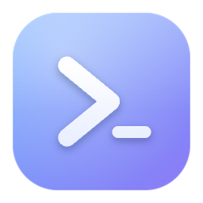
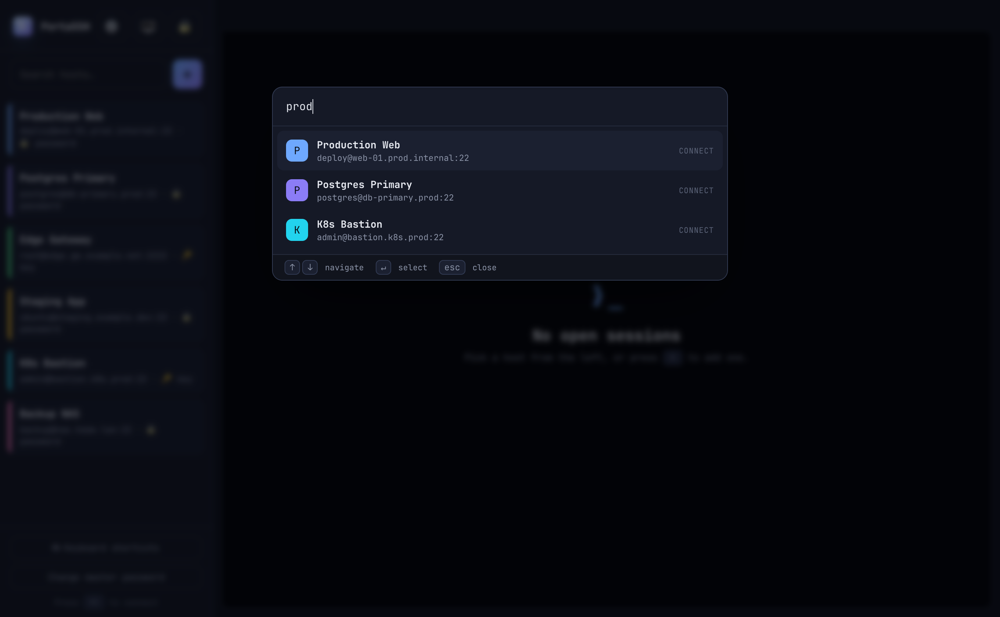
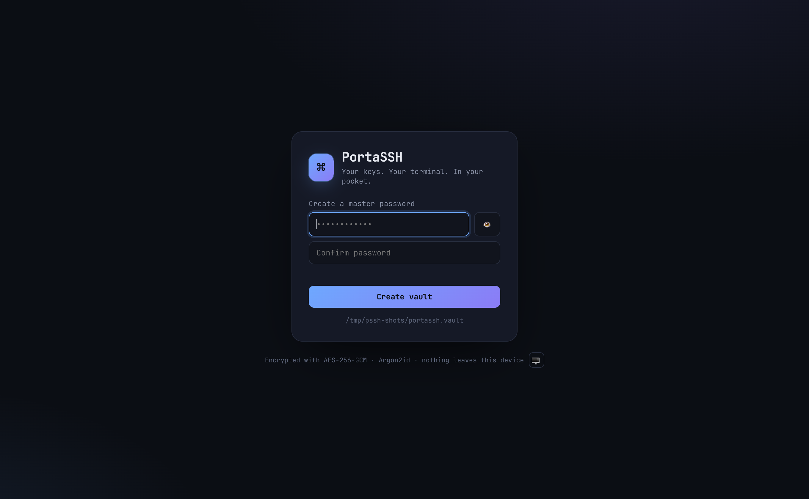
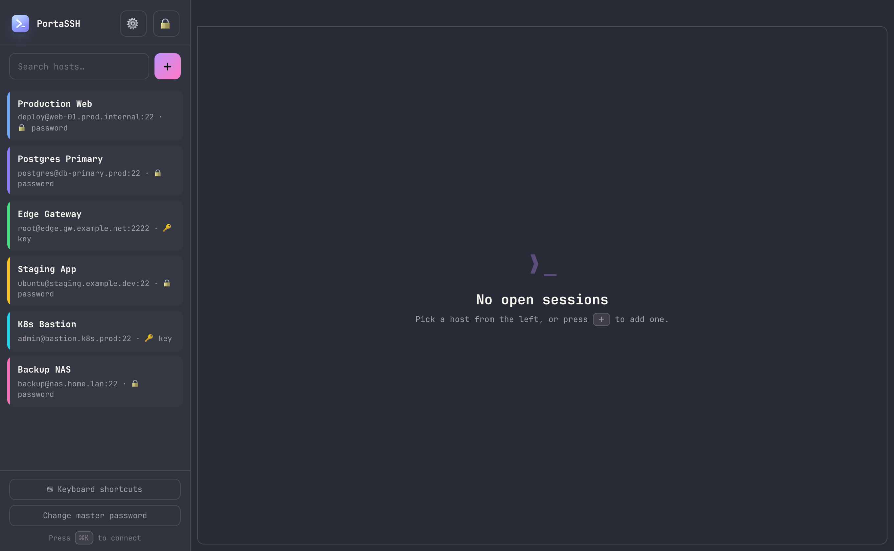
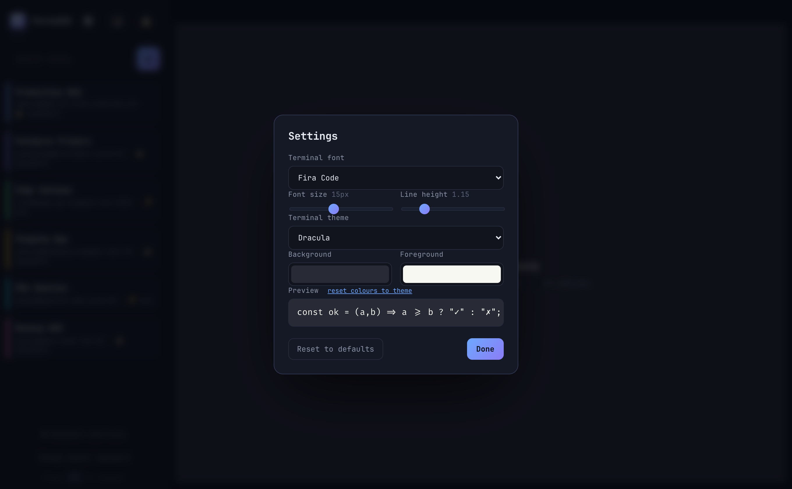
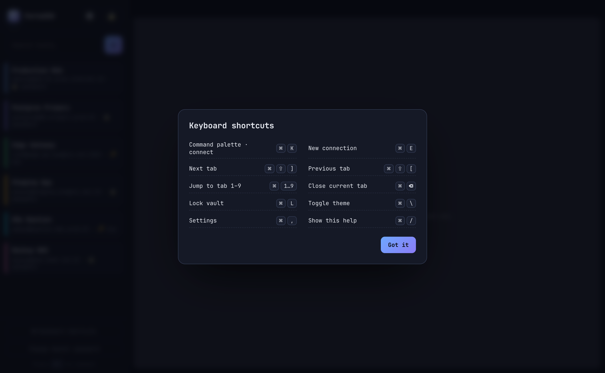
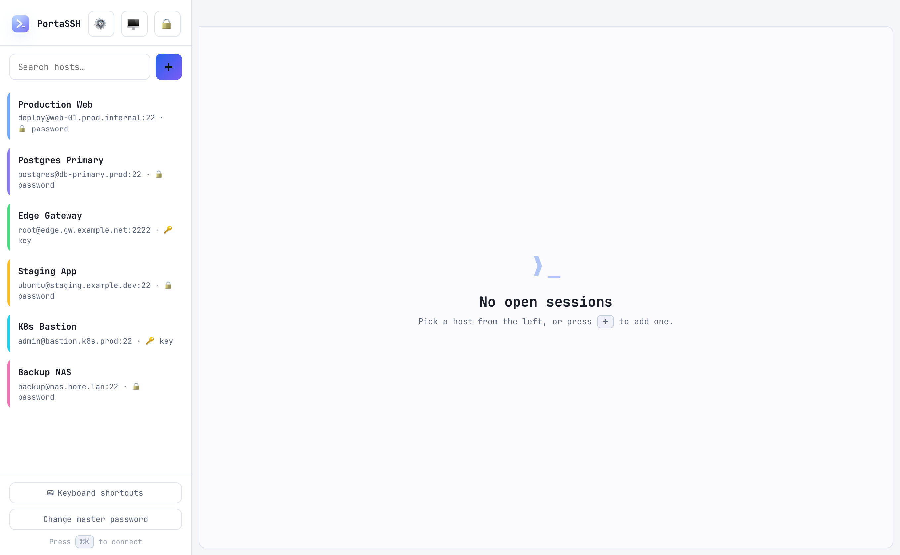

<div align="center">



# PortaSSH

### Your keys. Your terminal. In your pocket.

A **portable, encrypted, single-binary SSH client** you can carry on a USB stick.
No installation. No background services. Nothing written outside its own folder.
Just a single executable, a modern web-based terminal, and an encrypted vault
for all your SSH credentials.

[](LICENSE)




</div>

---

## ✨ Why PortaSSH?

You're a system engineer with dozens of hosts. You hop between machines that
aren't yours. You want your entire SSH world — credentials, keys, host list —
**encrypted on a stick**, usable anywhere, with a UI that's actually pleasant.

PortaSSH is that: one Go binary with the whole UI, fonts, and terminal baked in.
Plug in the stick, run it, unlock with your master password, and you're home.

## 🚀 Features

- 🔐 **Encrypted credential vault** — all hosts, passwords, and private keys live
  in a single `portassh.vault` file, encrypted with **AES‑256‑GCM** using a key
  derived from your master password via **Argon2id**. Keys exist only in memory
  and are wiped on lock.
- 💾 **Truly portable** — a single static binary with zero dependencies. Copy it
  to a USB stick alongside its vault and go. Cross-compiles to macOS, Linux, and
  Windows.
- 🖥️ **Multiple concurrent sessions** — tabbed terminals, each a real interactive
  PTY over SSH, powered by [xterm.js](https://xtermjs.org/).
- ⌨️ **Keyboard-first workflow** — a **command palette** (`⌘K` / `Ctrl+Shift+K`)
  to fuzzy-search and connect, plus shortcuts for everything. Built for people
  who live in the terminal.
- 🎨 **Beautiful, modern UI** — glassy dark theme, **light/dark that follows your
  system** (with manual override), and a built-in shortcuts overlay.
- 🔤 **Seven bundled coding fonts** — JetBrains Mono, Fira Code, Cascadia Code,
  IBM Plex Mono, Source Code Pro, Roboto Mono, and system monospace — all
  embedded, all offline. Tune font, size, and line-height in **Settings**.
- 🌈 **Terminal colour schemes** — nine popular presets (Dracula, Nord, One Dark,
  Monokai, Gruvbox, Solarized Dark/Light, Tomorrow Night, GitHub Light) plus
  custom **background / foreground** colour pickers.
- 💾 **Settings that persist** — all preferences are saved in a JSON file *next to
  the vault*, so they survive restarts and travel with the stick (not tied to the
  browser or the random port).
- 🛡️ **Isolated by default** — launches in an **extension-free browser window**
  with a dedicated profile, so your everyday browser's extensions can't observe
  the page. Loopback-only, gated behind a per-launch session token.
- 🔎 **TOFU host-key verification** — trust-on-first-use `known_hosts` that travels
  with the vault; a changed host key is treated as a hard error.

## 📸 Screenshots

|  |  |
|---|---|
| **Locked vault** — Argon2id + AES‑256‑GCM | **Your hosts, colour-coded** |
|  |  |
| **Command palette** — connect in two keystrokes | **Settings** — fonts, themes & colours (live, persisted) |
|  |  |
| **Shortcuts overlay** — platform-aware | **Light mode** — follows your system |
|  |  |

## 📦 Getting started

### Requirements
- To **run**: nothing — it's a single binary. (A Chromium-family browser —
  Chrome / Edge / Chromium / Brave — is recommended so PortaSSH can open its
  isolated, extension-free window; otherwise it falls back to your default browser.)
- To **build**: [Go 1.26+](https://go.dev/dl/).

### Download a release

Grab a prebuilt binary for your platform from the
[**Releases**](../../releases) page — one file, no installer. Builds are
produced by CI for macOS (Intel + Apple Silicon), Linux (amd64 + arm64), and
Windows, with a `SHA256SUMS` file to verify integrity:

```bash
# verify the download (example)
sha256sum -c SHA256SUMS --ignore-missing
chmod +x portassh-*        # macOS / Linux
./portassh-*
```

> **Note on unsigned binaries:** the releases aren't code-signed, so **macOS
> Gatekeeper** ("developer cannot be verified" → right-click ▸ Open, or
> `xattr -d com.apple.quarantine ./portassh-*`) and **Windows SmartScreen**
> ("More info" ▸ "Run anyway") will warn on first launch. Prefer building from
> source if you'd rather not.

### Build from source

```bash
git clone <your-repo-url> PortaSSH
cd PortaSSH
go build -ldflags "-s -w" -o portassh .
```

### Run

```bash
./portassh
```

That's it. PortaSSH prints a loopback URL with a one-time token, opens the UI in
an isolated browser window, and waits. On first run it asks you to **create a
master password**; after that it unlocks your vault.

The vault (`portassh.vault`), `known_hosts`, and the isolated `browser-profile/`
are all created **next to the binary** — so on a USB stick, everything travels
together.

### Cross-compile for the whole toolkit

```bash
GOOS=darwin  GOARCH=arm64 go build -ldflags "-s -w" -o dist/portassh-macos-arm64 .
GOOS=darwin  GOARCH=amd64 go build -ldflags "-s -w" -o dist/portassh-macos-intel .
GOOS=linux   GOARCH=amd64 go build -ldflags "-s -w" -o dist/portassh-linux-amd64  .
GOOS=windows GOARCH=amd64 go build -ldflags "-s -w" -o dist/portassh-windows.exe  .
```

### Flags

| Flag | Description |
|---|---|
| `--addr 127.0.0.1:0` | Loopback address to bind (`0` = random port). Non-loopback is refused. |
| `--dir <path>` | Where the vault lives (default: next to the binary). |
| `--plain-browser` | Open your default browser instead of the isolated window. |
| `--no-browser` | Open nothing; use the printed URL yourself. |

## ⌨️ Keyboard shortcuts

The modifier is deliberately **⌘ on macOS** (leaving `Ctrl` free for your shell)
and **Ctrl+Shift on Windows/Linux** (leaving plain `Ctrl` for readline), so
PortaSSH never steals keys your terminal needs.

| Action | macOS | Windows / Linux |
|---|---|---|
| Command palette · connect | `⌘K` | `Ctrl+Shift+K` |
| New connection | `⌘E` | `Ctrl+Shift+E` |
| Next / previous tab | `⌘⇧]` / `⌘⇧[` | `Ctrl+Shift+]` / `Ctrl+Shift+[` |
| Jump to tab 1–9 | `⌘1`…`⌘9` | `Alt+1`…`Alt+9` |
| Close current tab | `⌘⌫` | `Ctrl+Shift+⌫` |
| Lock vault | `⌘L` | `Ctrl+Shift+L` |
| Toggle theme | `⌘\` | `Ctrl+Shift+\` |
| Settings | `⌘,` | `Ctrl+Shift+,` |
| Shortcuts help | `⌘/` | `F1` |

## 🛡️ Security model

PortaSSH is built to be **honest about what it does and doesn't protect**.

**What's protected**

- **Vault at rest** — AES‑256‑GCM with an Argon2id-derived key (64 MiB, 3
  iterations). A lost stick doesn't hand over your credentials without the
  master password.
- **Secrets stay server-side** — the browser UI never receives stored passwords
  or private keys; they're only used in-process to establish a connection.
- **Local surface** — the server binds to **loopback only**, refuses non-loopback
  peers, and gates every request behind a **per-launch random session token**
  (passed via the URL fragment, kept out of server logs).
- **Browser extensions** — by launching in a **dedicated, extension-free profile**,
  the page is isolated from the extensions in your everyday browser, which could
  otherwise read keystrokes (including your master password) and terminal output.
- **Host keys** — trust-on-first-use `known_hosts`; a key that changes later is a
  hard failure, not a silent accept.

**Honest boundaries**

- **Malware already running as your OS user** is out of scope — it could keylog
  at the OS level or read the profile directory. This is true of *any* SSH client.
- The isolated-window protection needs a Chromium-family browser; with
  `--plain-browser` (or none installed) you fall back to your normal browser,
  where extensions may be active.

## 🧩 How it works

```
┌─────────────────────────────┐        ┌──────────────────────────────┐
│  Isolated browser window     │  ws/   │  PortaSSH  (single Go binary) │
│  ├─ xterm.js terminals       │◄──────►│  ├─ HTTP+WS server (loopback) │
│  ├─ command palette / UI     │  http  │  ├─ Argon2id + AES-GCM vault  │
│  └─ embedded fonts + assets  │        │  └─ x/crypto/ssh  → PTY       │
└─────────────────────────────┘        └───────────────┬──────────────┘
                                                        │ SSH
                                                        ▼
                                                  your servers
```

The entire frontend (HTML/CSS/JS, xterm.js, and all fonts) is embedded into the
binary with Go's `embed`, so there are **no external assets** and nothing to
install.

## 📄 License

**MIT** — see [LICENSE](LICENSE). Simple, permissive, and battle-tested: anyone
can use, modify, and ship PortaSSH, with attribution and no warranty. It's the
right default for a tool meant to be shared and carried around. (If you ever want
an explicit patent grant, Apache‑2.0 is the natural alternative.)

---

<div align="center">

**Vibe coded with love.** 💜

</div>
